# Using K-Means Clustering for Customer Segmentation

## About

A marketing department is looking to refine their advertising campaigns. In order to do this they would like to segment their existing consumer base. The department could manually construct customer segments but would like a reproducible method for future campaigns.

In this project, we will create an unsupervised machine-learning algorithm in Python to segment customers. Creating a K-Means Clustering algorithm to group customers by commonalities and provide the marketing department with insights into the different types of customers they have.

Skills Showcased:

-   Unsupervised Machine Learning - K-Means Clustering
-   Data Cleaning
-   Feature Engineering
-   Data Analysis

[View more projects like this!](https://cian-murray-doyle.github.io/)

## Libraries Overview

The following Python libraries will be used for this project.

``` python
import numpy as np
import pandas as pd
import seaborn as sns
from sklearn.cluster import KMeans
from sklearn.preprocessing import StandardScaler
import matplotlib.pyplot as plt
```

If these libraries are not installed, they can be installed with the following code.

``` python
# Install NumPy
!pip install numpy

# Install Pandas
!pip install pandas

# Install Seaborn
!pip install seaborn

# Install scikit-learn (includes KMeans)
!pip install scikit-learn

# Install Matplotlib
!pip install matplotlib
```

## Preparing the Data

Before any algorithms are applied, the dataset needs to be cleaned.

### Missing Values

Some examples of dealing with missing values are; removing them completely, replacing them with the mean/median or inferring the missing values. Due to the k-means clustering's sensitivity to missing values, our example will opt to remove all missing values from the dataset.

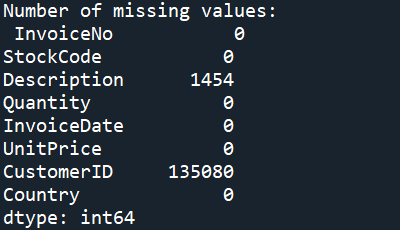

### Formatting

``` python
print("Original data: \n", online_sales.describe(),"\n")
online_sales["CustomerID"] = online_sales["CustomerID"].astype(str)
online_sales["InvoiceDate"] = pd.to_datetime(online_sales["InvoiceDate"],format='%d-%m-%Y %H:%M')
```

When using `online_sales.describe()` we see that some of our data is stored incorrectly. In our data `"CustomerID"` should not be a numeric value and `"InvoiceDate"` needs to be converted to date format.

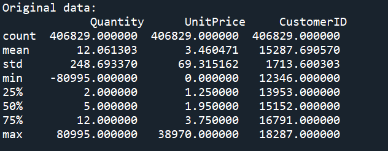

### Outliers

To detect outliers we will use `online_sales.describe()`. In our example, we can see there are negative values for “Quantity” and values of 0 for “UnitPrice”, as we know these are not possible values and therefore need to be removed.

Currently, with our data we do not have enough context to begin removing outliers using IQR or Z-Scores, we will remove these later on in the process.

### Feature Engineering

In order to keep refining our data for the model we need to gain new insights from out data. This will be done by creating new features and using and converting the data to an RFM table.

### Irrelevant Features

``` python
online_sales["TotalCost"] = online_sales["Quantity"]\*online_sales["UnitPrice"]

correlation_matrix = online_sales[["Quantity","UnitPrice","TotalCost"]].corr() sns.heatmap(correlation_matrix, vmin=0.0, vmax=1.0, annot=True) plt.title("Correlation Matrix",fontweight="bold") plt.show()
```

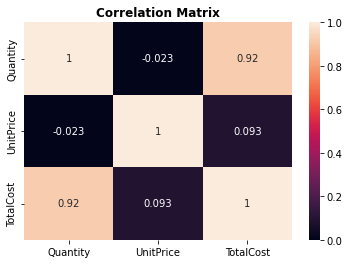

The heatmap shows us which features have a high correlation with one another, in our case we can use `"TotalCost"` rather than `"Quantity"` and `"Price"` when making our table/model.

### RFM Analysis

To apply this RFM analysis to our dataset, we will need to create features measuring the time since the last transaction for each customer(Recency), total transactions for each customer(Frequency) and total spend for each customer(Monetary).

#### Recency

``` python
most_recent_purchase = max(online_sales["InvoiceDate"])
online_sales["TimeDiff"] = most_recent_purchase - online_sales["InvoiceDate"]
online_sales_rfm_r = online_sales.groupby("CustomerID")["TimeDiff"].min()
online_sales_rfm_r.head()
#Above is using customer ID as index - needs to be reset with below
online_sales_rfm_r = online_sales_rfm_r.reset_index()
#Time difference is showing hours and miutes, this much detail is not needed
online_sales_rfm_r["TimeDiff"] = online_sales_rfm_r["TimeDiff"].dt.days 
online_sales_rfm_r.head()
```

#### Frequency

``` python
online_sales_rfm_f = online_sales.groupby("CustomerID")["InvoiceNo"].count()
online_sales_rfm_f.head()
#Above is using customer ID as index - needs to be reset with below
online_sales_rfm_f = online_sales_rfm_f.reset_index()
online_sales_rfm_f.head()
```

#### Monetary

``` python
online_sales_rfm_m = online_sales.groupby("CustomerID")["TotalCost"].sum()
online_sales_rfm_m.head()
#Above is using customer ID as index - needs to be reset with below
online_sales_rfm_m = online_sales_rfm_m.reset_index()
online_sales_rfm_m.head()
```

#### Creating RFM Table

``` python
online_sales_rfm = pd.merge(online_sales_rfm_r,
                            online_sales_rfm_f,
                            on="CustomerID",
                            how="inner")
online_sales_rfm = pd.merge(online_sales_rfm,
                            online_sales_rfm_m, 
                            on="CustomerID",
                            how="inner")
online_sales_rfm.columns = ["CustomerID", "Recency", "Frequency", "Monetary"]
```

#### Visualise Outliers

To improve the accuracy of the RFM analysis we will visualise the outliers with boxplots and then use the interquartile range method to remove outliers.

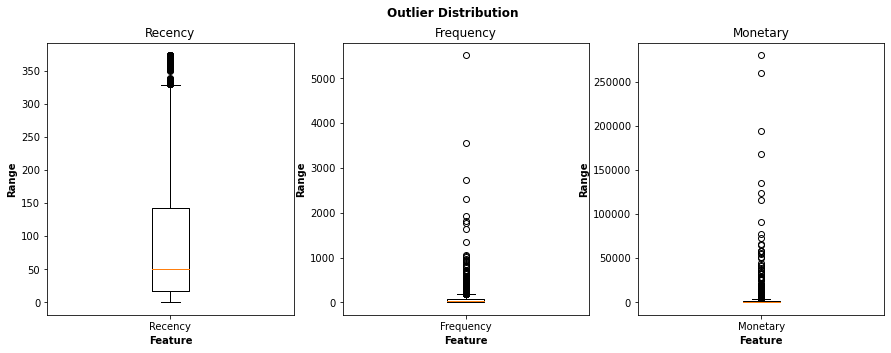

#### Remove Outliers

``` python
#Code Repeated for "Monetary"" and "Frequency"
q1 = np.percentile(online_sales_rfm["Recency"],25)
q3 = np.percentile(online_sales_rfm["Recency"],75)
iqr = q3 - q1
lowiqr = q1 - 1.5 * iqr
upperiqr = q3 + 1.5* iqr
online_sales_rfm = online_sales_rfm[(online_sales_rfm["Recency"] < upperiqr) & (
    online_sales_rfm["Recency"] > lowiqr)]

#Resetting and removing current index
online_sales_rfm = online_sales_rfm.reset_index(drop=True)
```

#### Standardising RFM Table

``` python
online_sales_rfm_df = online_sales_rfm[["Recency","Frequency","Monetary"]]
scaler = StandardScaler()
online_sales_rfm_scaled = scaler.fit_transform(online_sales_rfm_df)
online_sales_rfm_scaled = pd.DataFrame(online_sales_rfm_scaled)
online_sales_rfm_scaled.columns = ["Recency","Frequency","Monetary"]
print("Standardised RFM Table: \n",online_sales_rfm_scaled.head())
```

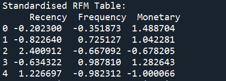

The final step in preparing data for our algorithm is to standardize/bring data to a common scale to improve the performance of the machine learning model. There are a few ways to achieve this, the method we demonstrate is the z-score method.

## K-Means Clustering

### N Clusters - Elbow Graph

``` python
cluster_range = [*range(2,11)]
lst = []
for i in cluster_range:
    kmeans = KMeans(n_clusters=i,max_iter=50)
    kmeans.fit(online_sales_rfm_scaled)
    lst.append(kmeans.inertia_)

plt.plot(lst,marker="o",linestyle=":",c="black")
plt.title("Elbow Method",fontweight="bold")
plt.xlabel("Number of Clusters",fontweight="bold")
plt.ylabel("Inertia", fontweight="bold")
plt.show()
```

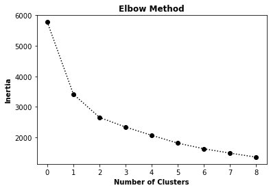

The optimal number of clusters is the point where the graph creates an "elbow", in our scenario 2 clusters would be too few so we will take 3 as our number of clusters.

Next, we will add the labels of each cluster back to our RFM table and visualise our clusters.

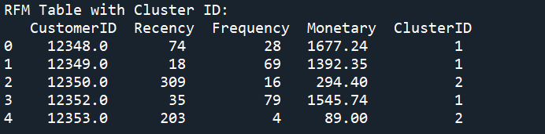

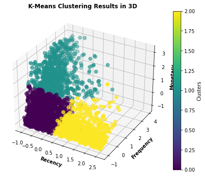

## Analysing the Clusters

We will use box plots to plot each `"ClusterID"` by `"Recency"`, `"Frequency"` and `"Monetary"` and gain insights about the behaviour of customers in each cluster.

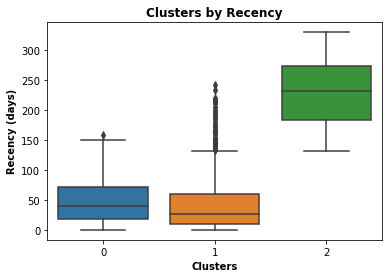

We can see that customers in cluster “0” have purchased the least recently and have a low frequency and a lot of outliers on spend. There are outliers in regards to number of purchases and cost of these purchases, however, the average customer in this cluster spends little, infrequently and has not made a purchase recently, for these reasons it would be best to avoid marketing towards these customers.

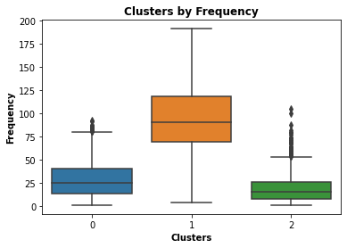

Customers in cluster “1” have mostly made purchases within the last 60 days, have made fewer total purchases and have lower spending. There are outliers in spending and frequency, however, the data indicates that customers within this cluster are probably new customers. From a business perspective, this would be an attractive segment to market towards as it could lead to an increased consumer base.

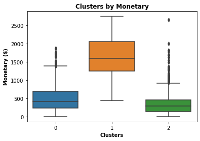

Cluster “2” has a high total spend, and number of purchases and has made purchases most recently. Although there seem to be many outliers in the recency of the last purchase, the high spending and frequency indicate these are customers familiar with the business. This would be a good segment to focus marketing on as they are already accustomed to the business and will be easy to entice to make recurring purchases.
